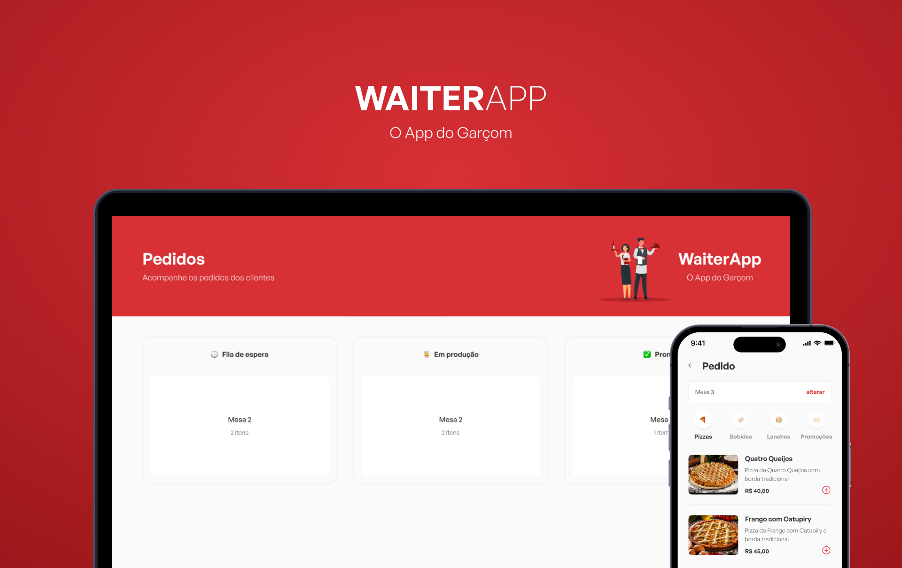

<h1 align="center"> Waiter App - O app do garçom </h1>

  

## 📜 Sobre

  Waiter App é um aplicativo para auxiliar restaurantes e garçons com os pedidos dos clientes.

  - É um projeto feito durante o mini curso: "O poder do JavaScript". 
  - Para a criação do Waiter App foi desenvolvido 3 aplicações: Back-end, Front-end e Mobile.

  - Acesse os links para ter mais informações sobre o desenvolvimento da aplicação:

    - [Back-end](https://github.com/Iann-rst/waiter-app/tree/main/server)

    - [Front-end: Versão Web](https://github.com/Iann-rst/waiter-app/tree/main/web)

    - [Versão Mobile](https://github.com/Iann-rst/waiter-app/tree/main/waiterMobile)

## :camera: Screenshot

https://user-images.githubusercontent.com/48128325/203806080-5d78fc7f-1529-4044-84f8-e23e26fe6dc2.mp4

