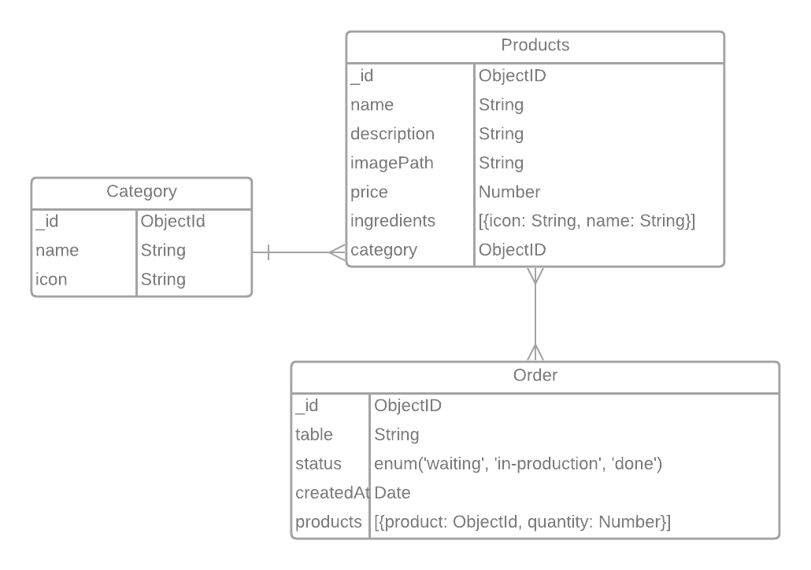

<h1 align="center"> WaiterApp API</h1>

## :man_technologist: Tecnologias Utilizadas

  - Node.js;
  - Express;
  - MongoDB;
  - Mongoose;
  - WebSockets;

## Construindo servidor back-end da aplicação

- Instalação e configuração das dependências utilizadas;
- Estabelecer a conexão com o banco de dados;
- Criação dos modelos do banco de dados:
  - Produtos;
  - Categorias;
  - Pedidos;

## Modelagem do banco de dados

  <h3 align="center">Diagrama Entidade Relacionamento</h3>
  

## Casos de uso

  - Listar as categorias;
  - Criar Categorias;
  - Listar os Produtos;
  - Criar Produtos;
  - Listar os Produtos por Categoria;
  - Listar os Pedidos (Orders);
  - Criar Pedidos;
  - Trocar Status do Pedido (Esperando, Em-Produção e Feito/Entregue);
  - Deletar/Cancelar um Pedido;

## Criar as rotas

  - get;
  - post;
  - patch;
  - delete;

## WebSockets

  - Foi utilizado **WebSockets** para a comunicação em tempo real com o front-end;
  - Quando um pedido é feito no aplicativo mobile e enviado para a API, o pedido é inserido no banco de dados e é feito a conexão com o Front-end (API -> Front-end) utilizando o WebSocket.
  - Por essa conexão é enviado o pedido para o front-end, fazendo o mesmo listar os pedidos criados em tempo real;

    - [Conexão em tempo real utilizando WebSockets](https://github.com/Iann-rst/Waiter-App/blob/main/server/src/app/useCases/orders/createOrders.ts)
