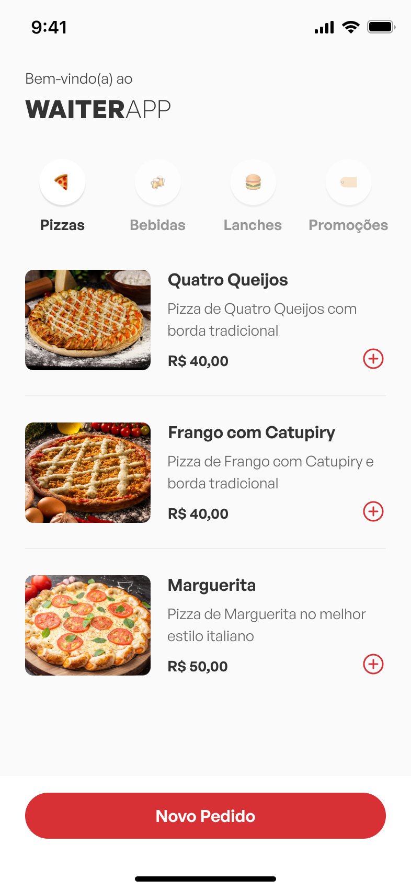
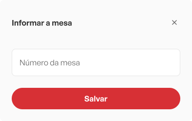
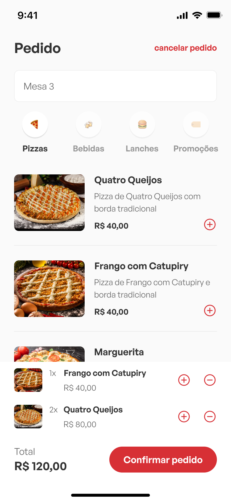

<h1 align="center"> WaiterApp Web</h1>

## :man_technologist: Tecnologias Utilizadas

- Expo;
- React;
- Typescript;
- Styled-components;
- Axios;

## :dart: Funcionalidades

- Criação da Home;
- Criação do modal para adicionar a mesa à pedido;
- Criação do modal do carrinho de itens do pedido;
- Criação dos detalhes de um produto;
- Criação Confirmação do Pedido;
- Conexão com a API usando **Axios;**
- Listagem das categorias;
- Listagem de todos os produtos;
- Listagem dos produtos por categoria;
- Realizar pedido;

## :camera: Screenshots

  

    <h3>Página Home</h3>
    
  

  

  

    <h3>Detalhes do item</h3>
    
  

  

  

    <h3>Modal Mesa</h3>
    
  

  

  

    <h3>Carrinho com 2 itens</h3>
    
  

  

  

    <h3>Confirmação do pedido</h3>
    
  

