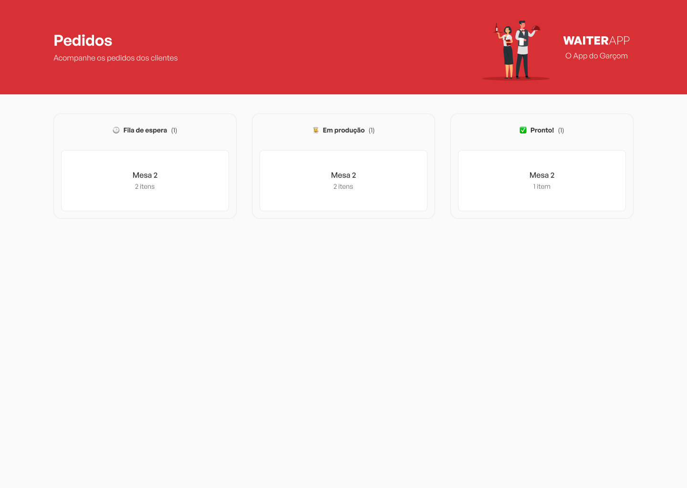
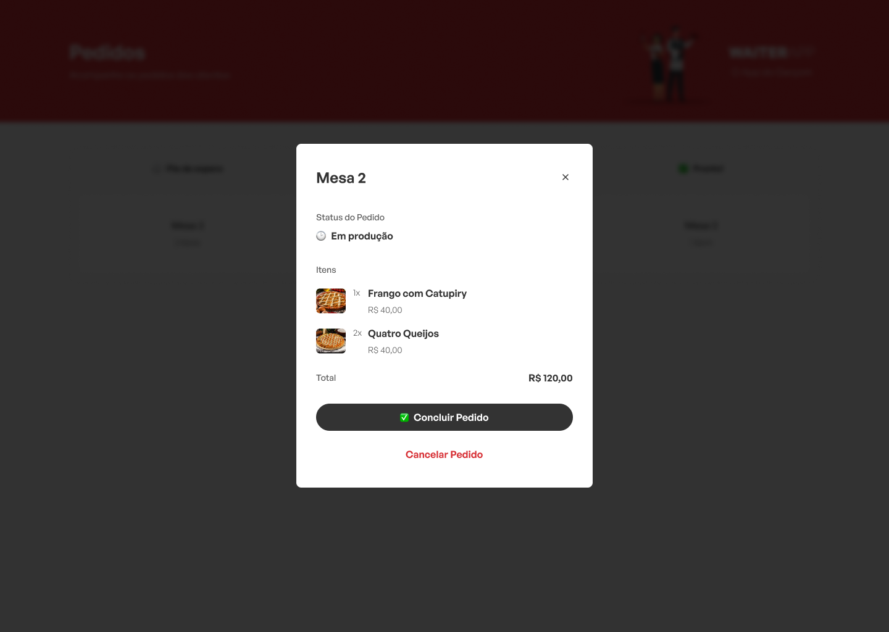

<h1 align="center"> WaiterApp Web</h1>

## :man_technologist: Tecnologias Utilizadas

- Vite;
- React;
- Typescript;
- Tailwindcss;
- Radix-ui/react-dialog;
- Axios;
- WebSockets;

## :dart: Funcionalidades

- Layout da aplicação;
- Criação do dashboard;
- Criação do modal com **Radix-ui;**
- Conexão com a API usando **Axios;**
- Comunicação em tempo real utilizando **WebSockets;**
- **Listar os pedidos;**
- **Trocar status do pedido (WAITING, IN_PRODUCTION, DONE);**
- **Deletar/Cancelar um pedido;**

## :camera: Screenshots

  <h3 align="center">Dashboard</h3>
  

  <h3>Modal aberto ao clicar em um pedido</h3>
  

